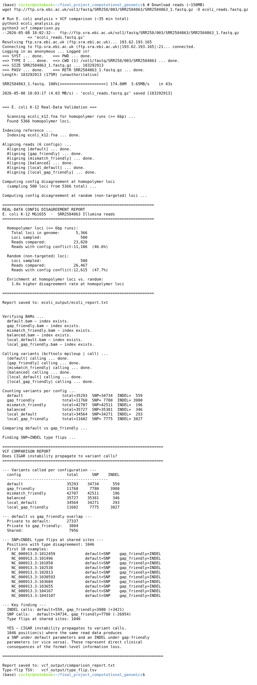

# Structural Information Loss in the SAM Alignment Format

**COMS 4761 — Computational Genomics, Columbia University**
**Author:** Victor Bula (veb2118)

---

## What Is Each File

| File | Description |
|------|-------------|
| `pipeline.py` | Synthetic corpus generator + Biopython parameter sweep + CIGAR classifier |
| `make_figure.py` | Generates `figure_category_distribution.png` (Figure 1 in the report) |
| `flip_demo.py` | Minimal standalone demo of the parameter-induced flip and inherent ambiguity |
| `bwa_validation.py` | Replicates the category-flip on BWA-MEM across 6 parameter configs |
| `ecoli_analysis.py` | Config disagreement rate at homopolymer vs. background loci on E. coli K-12 |
| `vcf_comparison.py` | Variant calling per config + SNP↔INDEL type flip detection |
| `tested_genome/ecoli_k12.fna` | E. coli K-12 MG1655 reference genome (4.6 MB, included for convenience) |
| `sample_output/synthetic_default.sam` | Sample SAM output from the default config |
| `sample_output/flip_demo_output.txt` | Captured output of `flip_demo.py` |

---

## System Requirements

- **Python:** 3.9 or higher
- **Python libraries:**
  ```bash
  pip install biopython matplotlib
  ```
- **System tools (must be in PATH):**
  ```bash
  sudo apt install bwa samtools bcftools
  ```
- **Tested on:** Ubuntu 24.04 / Linux Mint 22, x86-64
- **No GPU required.** All experiments run on a standard laptop CPU.

---

## Quick Test — Run on Synthetic Corpus (No External Data Needed)

This runs in under 2 minutes and requires only Python + Biopython:

```bash
# 1. Generate synthetic corpus, run parameter sweep, classify CIGARs
python3 pipeline.py

# 2. Reproduce the two-panel figure (Figure 1 in the report)
python3 make_figure.py
# Output: figure_category_distribution.png

# 3. Minimal demo of the flip and ambiguity phenomena
python3 flip_demo.py
```

To regenerate the sample output file:

```bash
mkdir -p sample_output
python3 flip_demo.py > sample_output/flip_demo_output.txt
```

---

## Full Replication — BWA-MEM Validation

Requires `bwa` in PATH:

```bash
python3 bwa_validation.py
# Output: bwa_output/validation_report.txt
# Runtime: ~5 minutes
```

---

## Full Replication — E. coli Real-Data Experiment

### Reference genome

The E. coli K-12 MG1655 reference genome is included in the repo at `tested_genome/ecoli_k12.fna` (4.6 MB). Both `ecoli_analysis.py` and `vcf_comparison.py` read from this path automatically.

If you need to re-download it:

```bash
mkdir -p tested_genome
wget https://ftp.ncbi.nlm.nih.gov/genomes/all/GCF/000/005/845/GCF_000005845.2_ASM584v2/GCF_000005845.2_ASM584v2_genomic.fna.gz -O tested_genome/ecoli_k12.fna.gz
gunzip tested_genome/ecoli_k12.fna.gz
```

### Illumina reads (not included — ~150 MB)

```bash
wget ftp://ftp.sra.ebi.ac.uk/vol1/fastq/SRR258/003/SRR2584863/SRR2584863_1.fastq.gz -O ecoli_reads.fastq.gz
```

### Run the analysis

```bash
# Config disagreement at homopolymer vs. background loci
python3 ecoli_analysis.py
# Output: ecoli_output/ecoli_report.txt
# Runtime: ~20 minutes (6 BWA-MEM alignments)

# Variant calling + SNP↔INDEL type flip detection
python3 vcf_comparison.py
# Output: vcf_output/comparison_report.txt, vcf_output/type_flip.tsv
# Runtime: ~15 minutes
```

---

## Parameters

All parameter configurations are defined at the top of each script. The six configs are:

| Config | Mode | Match | Mismatch | Gap-open | Gap-extend |
|--------|------|-------|----------|----------|------------|
| default | global | +2 | -4 | -6 | -1 |
| gap_friendly | global | +2 | -8 | -1 | -1 |
| mismatch_friendly | global | +2 | -1 | -10 | -10 |
| balanced | global | +2 | -3 | -3 | -3 |
| local_default | local | +2 | -4 | -6 | -1 |
| local_gap_friendly | local | +2 | -8 | -1 | -1 |

---
## Quick Sanity Check — Verifying flip_demo.py Runs Correctly

Running `python3 flip_demo.py` should produce output including:

```
DEMO 1 — Inherent ambiguity (5 equally-optimal alignments)
Optimal alignments found: 5   (all with score 3.0)

DEMO 2 — Parameter-induced flip (point mutation vs. indel pair)
MISMATCH-FRIENDLY: score=22  CIGAR=12M
GAP-FRIENDLY:      score=22  CIGAR=5M1D1I6M
```


## Expected Output (Full Pipeline)

Running the full pipeline produces the following:


